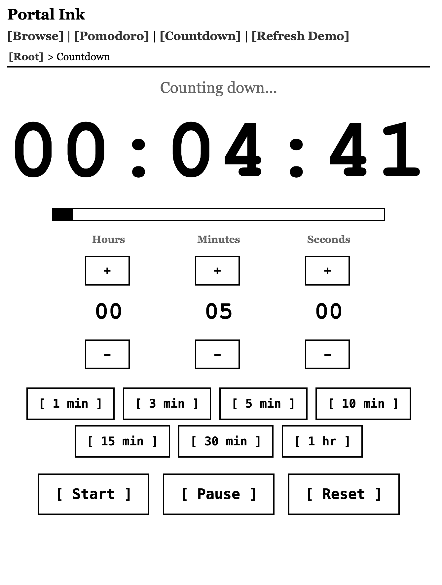

# kindle-ink-portal

A Kindle-optimized web dashboard built with Node.js, TypeScript, and server-side rendering. Designed for e-ink displays — grayscale-first, no flexbox, no CSS custom properties, progressive JS enhancement only.

Originally built as an exploration of what a retired Kindle Paperwhite can do as a desk tool.

<!-- markdownlint-disable MD033 -->
<table border="1">
    <tr>
        <td>
            
        </td>
    </tr>
</table>

---

## Pages

| Route        | Description                                                         |
| ------------ | ------------------------------------------------------------------- |
| `/`          | File browser — paginated directory listing, AJAX navigation         |
| `/pomodoro`  | Pomodoro timer — work/break cycles, session tracking                |
| `/countdown` | Countdown timer — presets + custom HH:MM:SS input                   |
| `/bench`     | JS benchmark — 6 tests with reference times for comparable devices  |
| `/demo`      | E-ink refresh demo — 6 tests showing different screen change levels |

---

## Quick start

```bash
pnpm install && pnpm build:client
npx tsx src/server.ts
```

Then open **<http://localhost:3500>** in your Kindle's browser (or any browser).

No build step required for development — `tsx` runs TypeScript directly.

---

## Configuration

There is no `.env` file. Environment variables are read directly from the shell:

| Variable      | Default | Description                                |
| ------------- | ------- | ------------------------------------------ |
| `PORT`        | `3500`  | Port the server listens on                 |
| `BROWSE_ROOT` | `$HOME` | Root directory exposed by the file browser |

Set them inline or export before running:

```bash
PORT=8080 BROWSE_ROOT=/Volumes/Media npx tsx src/server.ts
```

The variables are consumed in:

- `PORT` — [`src/server.ts`](src/server.ts)
- `BROWSE_ROOT` — [`src/services/files.ts`](src/services/files.ts)

---

## Theme

The server reads a `theme` cookie and sets a class on `<body>`:

| Cookie value          | Body class        | CSS file loaded            |
| --------------------- | ----------------- | -------------------------- |
| `grayscale` (default) | `theme-grayscale` | `public/css/grayscale.css` |
| `color`               | `theme-color`     | `public/css/color.css`     |

Switch theme by POSTing to `/api/theme` with `{ "theme": "color" }`, or set the cookie manually. No runtime switching — change requires a page refresh (natural for e-ink).

---

## Tech stack

| Layer           | Technology                              |
| --------------- | --------------------------------------- |
| Runtime         | Node.js 20+                             |
| Framework       | Express 5                               |
| Templates       | Nunjucks (Jinja2-compatible syntax)     |
| Language        | TypeScript (strict) — server + client   |
| Client JS       | TypeScript → ES5 IIFE via Rollup        |
| CSS             | Two static theme files, no preprocessor |
| Package manager | pnpm                                    |

### CSS constraints (WebKit 534 / Kindle browser)

- No CSS custom properties
- No flexbox, no grid — `<table>` + `float` layout only
- No emoji — ASCII labels only (`[Open]`, `[DL]`)
- Two static CSS files, server-selected — no runtime theme switching

### Client JS constraints

- ES5 target (Rollup + terser downlevel to ES3)
- No Promises in client code — callback-based XHR only
- Progressive enhancement — every route works as a full page load without JS

---

## Project structure

```()
src/
  server.ts           # Express app entry point
  middleware/
    theme.ts          # Reads theme cookie, sets res.locals
    ajax.ts           # Detects X-Requested-With header
    errors.ts         # 404 + global error handlers
    logging.ts        # Request logger
  routes/
    browse.ts         # File browser (/ and /*path)
    api.ts            # POST /api/log, POST /api/theme
    pomodoro.ts       # GET /pomodoro
    countdown.ts      # GET /countdown
    bench.ts          # GET /bench
    demo.ts           # GET /demo
  services/
    files.ts          # listDirectory(), getBrowseRoot()
  utils/
    paths.ts          # safePath() — directory traversal guard
    pagination.ts     # paginate()
    filetypes.ts      # Extension → category mapping

client/
  main.ts             # AJAX navigation (all pages)
  pomodoro.ts         # Pomodoro timer logic
  countdown.ts        # Countdown timer logic
  demo.ts             # Refresh demo interactions
  bench.ts            # JS benchmark runner

views/
  base.njk            # Base layout
  browse.njk          # File browser page
  pomodoro.njk        # Pomodoro page
  countdown.njk       # Countdown page
  demo.njk            # Refresh demo page
  error.njk           # Error page
  partials/
    browse-ajax.njk   # AJAX partial (breadcrumbs + file list)
    file-list.njk     # File table + pagination

public/
  css/
    base.css          # Shared layout styles
    grayscale.css     # Grayscale e-ink theme
    color.css         # Color e-ink theme
  js/                 # Built client bundles (git-ignored, build locally)
```

---

## Building client JS

The client bundles are git-ignored (they're build artifacts). Build them before running:

```bash
pnpm build:client
```

Or build everything (server + client):

```bash
pnpm build
```

---

## Scripts

```bash
pnpm dev            # Run server with tsx watch (auto-restart)
pnpm build          # Compile server TS + build client bundles
pnpm build:client   # Build client bundles only (Rollup)
pnpm build:server   # Compile server TypeScript only
pnpm typecheck      # Type-check without emitting
pnpm lint           # ESLint
pnpm format         # Prettier
pnpm clean          # Remove dist/ and public/js/
```
